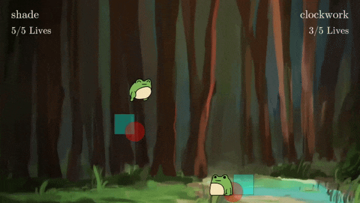
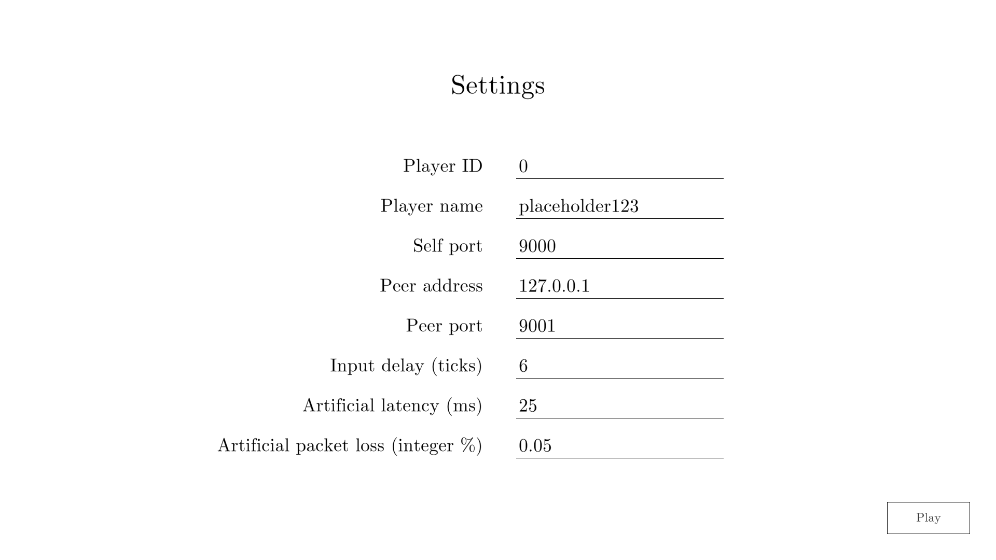

# Peer-to-peer Rollback



- Teal box = hurtbox, red circle = hitbox. Both are drawn immediately after rollback, i.e. before prediction and extrapolation.
- **"Client"-side prediction**: the player simulates ahead from the latest tick of consensus after rolling back to that tick. This provides immediately responsive controls.
- **Entity extrapolation, aka. dead reckoning**: the peer is extrapolated from their latest input beyond the latest tick of consensus. This grants the player a live approximation of their opponent in exchange for "snapping" artifacts whenever the extrapolation is incorrect, e.g. on directional changes.

The above GIF depicts demo gameplay with an artificial 100 ms ping between two players running on separate processes on the same host.

This is a solo project written in C# using Unity and [DarkRift 2](https://www.darkriftnetworking.com/), and illustrated using Photoshop.

Based on [Divekick (2013)](https://store.steampowered.com/app/244730/Divekick/), a minimalistic fighting game.


## Table of contents

* [Core loop](#core-loop)
* [Player](#player)
    + [Player movement manager](#player-movement-manager)
    + [Player input manager](#player-input-manager)
    + [Player animation manager](#player-animation-manager)
* [Time](#time)
* [Synchronisation](#synchronisation)
* [Connectivity](#connectivity)
* [TCP vs UDP, message sending and serialisation](#tcp-vs-udp-message-sending-and-serialisation)
* (Sections with discussions of potential improvements: player animation manager, synchronisation, connectivity)


## Core loop

Please entertain the following terminology hereon:
- "Self player": the actor that is being controlled ("autonomous proxy" in UE-speak)
- "Peer player": the actor representing the remote peer ("simulated proxy" in UE-speak)
- "Intermission": the period between rounds where the game is paused

The game loop is as follows:
1. Record our own input for the current tick;
2. Send all un-acknowledged inputs to our peer;
3. Roll back to the latest tick for which we had both players' inputs for *in the previous game loop*;
4. Simulate both players for as many ticks as we have both players' inputs for *now*;
5. Save the resulting state so that we can roll back to it in the next game loop;
6. Finally, simulate up until the current tick by performing "client"-side prediction and entity extrapolation.

[GameController.cs](./Assets/Scripts/Gameplay/GameController.cs)

```C#
void ExecuteGameLoop(ushort currentTick)
{
    RunPreGameLoop();
    m_GameLoop(currentTick);
    RunPostGameLoop();
}

void RunPreGameLoop()
{
    SetSpritesVisible(false);
}

void GameLoop(ushort currentTick)
{
    if (m_IsInIntermission)
    {
        // Ensure the peer has enough input to get to intermission
        SelfPlayer.SendUnackedInputs(untilTickExclusive: TickService.Add(m_IntermissionStartTick, 1));
        return;
    }

    SelfPlayer.WriteInput(currentTick);
    SelfPlayer.SendUnackedInputs(untilTickExclusive: TickService.Add(currentTick, 1));

    // Rollback to the gamestate and tick saved by the latest call
    // to SaveRollbackState().
    // In a client-server scheme, this tick would be the latest
    // tick received from the server, i.e. the latest authoritative
    // tick. In our peer-to-peer setup, authority is democratised. The
    // latest authoritative tick is the latest one for which we have
    // all players' information, i.e. consensus.
    // Here, specifically, we end up rolling back to the latest tick
    // for which we had both players' inputs for *in the previous game loop*.
    ushort t = RollbackManager.Rollback();

    // t <= currentTick
    Assert.IsTrue(TickService.IsBeforeOrEqual(t, currentTick));

    // Simulate both players for as many ticks as we have both players'
    // inputs for *now*, starting from and including t
    for (; PeerPlayer.HasInput(t) && TickService.IsBeforeOrEqual(t, currentTick); t = TickService.Add(t, 1))
    {
        SelfPlayer.Simulate(t);
        PeerPlayer.Simulate(t);
        // Actually run the simulation using Physics2D.Simulate()
        RunSimulation(isSimulatingOfficially: true, tick: t);
    }

    // t <= currentTick+1
    Assert.IsTrue(TickService.IsBeforeOrEqual(t, TickService.Add(currentTick, 1)));

    // By now, t represents the next tick that needs to be simulated
    RollbackManager.SaveRollbackState(t);

    // From the guard of the previous loop
    Assert.IsTrue(!PeerPlayer.HasInput(t) || TickService.IsAfter(t, currentTick));

    // Finish the simulation if needed by performing prediction and
    // extrapolation
    for (; TickService.IsBeforeOrEqual(t, currentTick); t = TickService.Add(t, 1))
    {
        Assert.IsTrue(!PeerPlayer.HasInput(t));

        // "Client"-side prediction
        SelfPlayer.Simulate(t);
        // Entity extrapolation, aka. dead reckoning
        PeerPlayer.SimulateWithExtrapolation();
        // We ignore collisions when isSimulatingOfficially is false
        RunSimulation(isSimulatingOfficially: false, tick: t);
    }
}

void RunPostGameLoop()
{
    SetSpritesVisible(true);

    // As per common practice, we run rendering-related functions once
    // after the game loop instead of during every tick's simulation.
    SelfPlayer.RenderAnimation();
    PeerPlayer.RenderAnimation();
}
```

We support testing in singleplayer by offering an alternate game loop. This was invaluable for implementing subsystems such as animation.

```C#
void Awake()
{
    // Progress physics only when Physics2D.Simulate() is called, as
    // opposed to automatically in FixedUpdate()
    Physics2D.simulationMode = SimulationMode2D.Script;

    m_GameLoop = DebugFlags.IsDebuggingSingleplayer ? DebugSingleplayerGameLoop : GameLoop;
}

void DebugSingleplayerGameLoop(ushort currentTick)
{
    SelfPlayer.WriteInput(currentTick);

    // We still rollback to be able to test rollback-related
    // mechanics, e.g. animation rollback
    ushort t = RollbackManager.Rollback();

    // Force rollback to occur by never simulating up to more than
    // 8 ticks (arbitrary magic number) behind the current tick
    for (; TickService.IsBeforeOrEqual(t, TickService.Subtract(currentTick, 8)); t = TickService.Add(t, 1))
    {
        SelfPlayer.Simulate(t);
        RunSimulation(isSimulatingOfficially: true, tick: t);
    }

    RollbackManager.SaveRollbackState(t);

    for (; TickService.IsBeforeOrEqual(t, currentTick); t = TickService.Add(t, 1))
    {
        SelfPlayer.Simulate(t);
        RunSimulation(isSimulatingOfficially: false, tick: t);
    }
}
```


## Player

Each player is accessed through a manager inherited from [Player.cs](./Assets/Scripts/Gameplay/Player/Manager/Player.cs). This manager defers calls to multiple sub-managers. We'll describe some of the more interesting ones.

### Player movement manager

The movement manager stores its current state `m_State` alongside a state `m_RollbackState` for rolling back to.

This component was the most challenging aspect of this project due to the abundance of edge cases and Unity physics gotchas, which are elaborated below.

[MovementManager.cs](./Assets/Scripts/Gameplay/Player/Movement/MovementManager.cs)

```C#
public void SaveRollbackState()
{
    m_RollbackState.Assign(m_State);
}

public void Rollback()
{
    m_State.Assign(m_RollbackState);

    // (Abbreviated for README - please refer to the file for more details.)
    // Nuance: we "turn the collider on and off again" so it can be recognised
    // during rollback even if it was just triggered during prediction.
    KickCollider.SetActive(false);
    SyncKickColliderWithState();

    // Preserve invariant (*)
    m_RB2D.position = m_State.RigidbodyPosition;

    // (Abbreviated for README - please refer to the file for more details.)
    // Teleporting, i.e. modifying transform.position directly, is essential.
    // We can't just set the rigidbody position because Unity resolves rigidbody
    // movements by interpolating between past and present states, which results
    // in collisions that are nonsensical in the context of rollback.
    transform.position = m_State.RigidbodyPosition;
    Physics2D.SyncTransforms();

    Assert.IsTrue(m_RB2D.position == m_State.RigidbodyPosition);
}

public void Simulate(ushort tick)
{
    // (*) Invariant: m_RB2D.position == m_State.RigidbodyPosition

    float deltaTime = TickService.TimeBetweenTicksSec;

    m_State.CandidatePosition = m_RB2D.position;

    GroundCheck();
    ProposeVelocity(tick, deltaTime);
    AdjustVelocityForObstructions();

    // Move along the final m_State.CandidateVelocity
    m_State.CandidatePosition += m_State.CandidateVelocity * deltaTime;

    if (m_State.CandidatePosition != m_RB2D.position)
    {
        // Assigns to m_RB2D.position *in the next simulation*
        m_RB2D.MovePosition(m_State.CandidatePosition);

        // It's tempting to believe that we just falsified the
        // invariant (*) by "assigning" to m_RB2D.position.
        // However, this assignment hasn't actually unfolded yet since
        // we've yet to run a simulation step.
        // The invariant is still true and will only become false
        // after simulation. So, we'll defer doing anything until
        // then (see OnSimulationProgressed()).
    }

    UpdateIsFacingLeftBasedOnVelocity();
}


void OnSimulationProgressed(ushort untilTickExclusive)
{
    // The simulation has just applied any changes from Simulate()
    // to m_RB2D.position

    // Preserve invariant (*)
    m_State.RigidbodyPosition = m_RB2D.position;
}

```

### Player input manager

Each player maintains a circular input buffer. This buffer is indexed by tick and stores a bit array of inputs that were active during that tick.

[InputBuffer.cs](./Assets/Scripts/Gameplay/Player/Input/InputBuffer.cs)

```C#
// m_InputHistory[tick] = input bit array during that tick
ushort[] m_InputHistory = new ushort[TickService.MaxTick];
ushort m_StartInclusive;
ushort m_EndExclusive;

public bool HasInput(ushort tick)
{
    return TickService.IsAfterOrEqual(tick, StartInclusive) && TickService.IsBefore(tick, EndExclusive);
}

// Same as GetButton/GetKey from Unity's old Input system,
// except tick-based instead of frame-based
public bool GetInput(ushort tick, ushort inputMask)
{
    Assert.IsTrue(HasInput(tick));
    return (m_InputHistory[tick] & inputMask) != 0;
}
```

The self player is responsible for sending its inputs. We send all un-acknowledged inputs so that, in the case of packet loss, a peer is always able to reconstruct our input history.

[SelfInputManager.cs](./Assets/Scripts/Gameplay/Player/Input/SelfInputManager.cs)

```C#
public void SendUnackedInputs(ushort untilTickExclusive)
{
    List<ushort> inputs = new List<ushort>();

    for (ushort t = m_NextTickToSend; TickService.IsBefore(t, untilTickExclusive); t = TickService.Add(t, 1))
    {
        inputs.Add(m_InputBuffer.GetRawInput(t));
    }

    if (inputs.Count == 0)
    {
        return;
    }

    SendInputs(startTick: m_NextTickToSend, inputs: inputs.ToArray());
}

void OnMessageReceived(object sender, DarkRift.Client.MessageReceivedEventArgs e)
{
    using (Message message = e.GetMessage() as Message)
    {
        if (message.Tag == Tags.InputAck)
        {
            HandleInputAckMsg(sender, e);
        }
    }
}

void HandleInputAckMsg(object sender, DarkRift.Client.MessageReceivedEventArgs e)
{
    using (Message message = e.GetMessage())
    {
        InputAckMsg msg = message.Deserialize<InputAckMsg>();

        if (TickService.IsAfter(msg.ReceivedUntilTickExclusive, m_NextTickToSend))
        {
            m_NextTickToSend = msg.ReceivedUntilTickExclusive;
        }
    }
}
```

The peer player is accordingly responsible for receiving inputs and sending acks.

[PeerInputManager.cs](./Assets/Scripts/Gameplay/Player/Input/PeerInputManager.cs)

```C#
void OnMessageReceived(object sender, MessageReceivedEventArgs e)
{
    using (Message message = e.GetMessage() as Message)
    {
        if (message.Tag == Tags.Input)
        {
            HandleInputMsg(sender, e);
        }
    }
}

void HandleInputMsg(object sender, MessageReceivedEventArgs e)
{
    using (Message message = e.GetMessage())
    {
        InputMsg msg = message.Deserialize<InputMsg>();

        if (TickService.IsAfter(msg.EndTickExclusive, m_InputBuffer.EndExclusive))
        {
            ushort tick = msg.StartTick;

            foreach (ushort input in msg.Inputs)
            {
                // Don't overwrite inputs
                if (!m_InputBuffer.HasInput(tick))
                {
                    m_InputBuffer.WriteInput(tick, input);
                }

                tick = TickService.Add(tick, 1);
            }

            m_InputBuffer.EndExclusive = msg.EndTickExclusive;
        }

        SendInputAck(msg.EndTickExclusive);
    }
}
```

### Player animation manager

Like the movement manager, the animation manager maintains a current state as well as a rollback state.

[AnimationManager.cs](./Assets/Scripts/Gameplay/Player/Animation/AnimationManager.cs)

```C#
public void SaveRollbackState()
{
    m_RollbackState.Assign(m_State);
}

public void Rollback()
{
    m_State.Assign(m_RollbackState);
}

public void Simulate()
{
    // Defer propagating these changes to the animator until rendering
    m_State.MotionTime += MotionTimeScale * TickService.TimeBetweenTicksSec;
}

public void Render()
{
    m_Animator.SetFloat("MotionTime", m_State.MotionTime);

    if (m_State.IsHit)
    {
        SwitchToAnimation("Hit");
        return;
    }

    if (RecentlyLanded())
    {
        SwitchToAnimation("Land");
        return;
    }

    if (m_MovementManager.IsKicking)
    {
        SwitchToAnimation("Kick");
        return;
    }

    if (m_MovementManager.Velocity.y > 0.0f && !Mathf.Approximately(m_MovementManager.Velocity.y, 0.0f))
    {
        SwitchToAnimation("Jump");
        return;
    }

    if (!Mathf.Approximately(m_MovementManager.Velocity.x, 0.0f))
    {
        SwitchToAnimation("Move");
        return;
    }

    SwitchToAnimation("Idle");
}

void SwitchToAnimation(string name)
{
    if (name == CurrentAnimationName)
    {
        return;
    }

    m_Animator.Play(name, layer: 0, normalizedTime: m_State.MotionTime % 1.0f);
    CurrentAnimationName = name;
}

```

The current state is maintained by subscribing to callbacks from the movement manager, such as the following.

```C#
void OnIsGroundedChanged(bool isGrounded)
{
    if (isGrounded)
    {
        m_State.LastLandedAtTick = Clock.Instance.CurrentTick;
    }
}
```

I initially tried to implement this animation subsystem using Unity's standard animation state machine. This felt unnatural and overcomplicated. Because of rollback, 1) every animation must be prepared to transition into any other, 2) the choice of transition must involve checks performed in a particular order, and 3) we require granular control over motion time. It ended up being far simpler (and more obviously correct) to just manually set the appropriate animation every frame.

Still, we sacrifice the accessibility of Unity's animation state machine by opting for this code-first approach. Adding an animation or otherwise altering animation behaviour requires one to dive into C#. In a larger project, this would likely be an obstacle placed before designers and animators. An ideal solution would probably involve exposing `Render()` to some editor config or visual scripting system.


## Time

Our clock is written as follows.

[Clock.cs](./Assets/Scripts/Gameplay/Clock.cs)

```C#
IEnumerator NextTick()
{
    while (true)
    {
        if (m_JustUnpaused)
        {
            m_JustUnpaused = false;
            CurrentTick = TickService.Add(m_PausedAtTick, 1);
        }

        // Keep this first so that the start tick is ran
        TickUpdated?.Invoke(CurrentTick);

        yield return new WaitForSecondsRealtime(TickService.TimeBetweenTicksSec);

        // We implement pausing this way instead of restarting the coroutine
        // in order to preserve the original cadence
        if (!Paused)
        {
            IncrementCurrentTick();
        }
    }
}
```

We define the service below for handling tick arithmetic.

Note that we store ticks as ushorts and use a tickrate of 60 ticks per second, which means that overflow occurs approximately every 18 minutes. We avoid this by wrapping around tick values using modular arithmetic.

[TickService.cs](./Assets/Scripts/Services/TickService.cs)

```C#
public const ushort Tickrate = 60;
public const float TimeBetweenTicksSec = 1f / Tickrate;
public const ushort StartTick = 0;
public const ushort MaxTick = 65530; // A bit less than the actual maximum of a ushort so that incrementing won't overflow

static readonly ushort LargeTickThreshold = (ushort)(MaxTick-SecondsToTicks(100));
static readonly ushort SmallTickThreshold = SecondsToTicks(100);

public static ushort Add(ushort tick, int x)
{
    return (ushort)MathExtensions.Mod((int)tick + x, MaxTick);
}

public static bool IsBefore(ushort tick1, ushort tick2)
{
    // If tick1 is large and tick2 is small, then assume tick2 has
    // wrapped around and hence tick2 > tick1 => true

    // Similarly, if tick1 is small and tick2 is large, then assume
    // tick1 has wrapped around so tick1 > tick2 => false

    return IsLarge(tick1) && IsSmall(tick2)
        ? true
        : IsSmall(tick1) && IsLarge(tick2)
            ? false
            : tick1 < tick2;
}
```


## Synchronisation

Tick synchronisation is necessary to account for the inherent clock drift between different machines as well as any desynchronisation that arises from client-side compute latency.

We offer a really primitive solution. Each client estimates the ping to their peer by measuring the recent average RTT from a perpetual exchange of pings. When a client detects they're behind, they attempt to catch up by accelerating their clock.

[NetSynchronisationManager.cs](./Assets/Scripts/Gameplay/NetSynchronisationManager.cs)

```C#
void Update()
{
    ushort peerCurrentTick = EstimatePeerCurrentTick();
    ushort behindByTick = TickService.IsAfter(peerCurrentTick, Clock.Instance.CurrentTick)
        ? TickService.Subtract(peerCurrentTick, Clock.Instance.CurrentTick)
        : (ushort)0;

    if (m_IsCatchingUp)
    {
        if (HasCaughtUp(behindByTick))
        {
            StopCatchingUp();
        }
    }
    // Not catching up and:
    else if (NeedsToCatchUp(behindByTick))
    {
        StartCatchingUp();
    }
}

ushort EstimatePeerCurrentTick()
{
    // If this function is called immediately after receiving a peer
    // ping (which is the most intuitive example), then
    // m_ReceivedLatestPeerPingAtSec == Time.time, which simplifies
    // everything to (m_LatestPeerPingTick + #ticks in 0.5*RTT)
    float peerSentPingAtSec = m_ReceivedLatestPeerPingAtSec - (0.5f * EstimateRTTSec());
    float timeSincePeerSentPingSec = Time.time - peerSentPingAtSec;
    Assert.IsTrue(timeSincePeerSentPingSec >= 0);
    int timeSincePeerSentPingTick = (int)(timeSincePeerSentPingSec * (float)TickService.Tickrate);
    return TickService.Add(m_LatestPeerPingTick, timeSincePeerSentPingTick);
}

// Dampen net jitter by taking an average of recent RTT measurements
float EstimateRTTSec()
{
    return m_RTTsSec.Count == 0
        ? 0
        : m_SumRTTsSec / m_RTTsSec.Count;
}

// We accept tick differences within a threshold to prevent clients from
// continuously flip-flopping between catching up and resting in a
// futile pursuit of perfect synchronisation
bool NeedsToCatchUp(ushort behindByTick)
{
    return behindByTick >= m_StartCatchingUpThresholdTick;
}

bool HasCaughtUp(ushort behindByTick)
{
    return behindByTick <= m_StopCatchingUpThresholdTick;
}

void StartCatchingUp()
{
    m_IsCatchingUp = true;
    Clock.Instance.SetSpeedMultiplier(m_CatchupSpeed);
}

void StopCatchingUp()
{
    Clock.Instance.ResetSpeedMultiplier();
    m_IsCatchingUp = false;
}

void HandlePingAckMsg(object sender, MessageReceivedEventArgs e)
{
    using (Message message = e.GetMessage())
    {
        PingAckMsg msg = message.Deserialize<PingAckMsg>();

        // Peer acked the latest ping
        Assert.IsTrue(msg.ReceivedTick == m_LatestPingSentTick);

        AddRTTSec(RTTSec: Time.time - m_LatestPingSentTimestampSec);

        // Continually circulate the ping
        SendPing();
    }
}
```

This synchronisation implementation behaves poorly and is perhaps the area most in need of improvement in this project. We suspect that our RTT is inaccurate as it intermingles network latency with application latency. This could be mostly alleviated by pulling RTT measurements from a lower-level pinging facility. However, our current error is more than what this issue reasonably accounts for, so I suspect there are other issues at play..?


## Connectivity

We provide the following configuration options before starting the game.



In-practise, the player ID, peer address and peer port would be provided by a matchmaking server. The player name would be available from an authentication step, and the self port would be automatically chosen.

We implement peer-to-peer with symmetric nodes. Each player has a server `m_SelfServer` and a client `m_SelfClient`. The client connects to the peer's `m_SelfServer` and is used as a read-only channel. This is mirrored on the peer's side and the resulting connection to our `m_SelfServer` is stored as `m_PeerClient` and used as a write-only channel.

[ConnectionManager.cs](./Assets/Scripts/Gameplay/ConnectionManager.cs)

```C#
XmlUnityServer m_SelfServer;
UnityClient m_SelfClient; // Connection from self client (us: reader) to peer server (writer)
IClient m_PeerClient; // Connection from peer client (reader) to self server (us: writer)

public IEnumerator Setup()
{
    if (m_SetupComplete)
    {
        Debug.LogError("Setup called multiple times");
    }

    m_SetupComplete = false;

    // Setup self server
    yield return SetupServer(Settings.SelfPort);

    // Connect self client to peer server
    yield return ConnectClient(Settings.PeerAddress, Settings.PeerPort);

    // Wait until peer client is connected to self server
    yield return new WaitUntil(() => m_PeerClient != null && (m_PeerClient.ConnectionState == ConnectionState.Connected));

    Debug.Log("Setup complete");

    m_SetupComplete = true;
}
```

This scheme could be scaled to more than two players by setting up a server-client pair for each additional player.

Alternatively, one could employ a relay server to route messages between peers. This would allow each node to just maintain a single connection - a massive engineering simplification. However, this would also introduce server upkeep costs, which would undermine one of the benefits of peer-to-peer. The relay would also be a central point of failure.

This project doesn't implement NAT busting. A real-world deployment would require peers behind NATs to port forward.


## TCP vs UDP, message sending and serialisation

We use TCP for sending initial player metadata (usernames) and UDP for everything else.

We simulate latency and packet loss by wrapping DarkRift's `SendMessage()` function in the following code.

[ConnectionManager.cs](./Assets/Scripts/Gameplay/ConnectionManager.cs)

```C#
public void SendMessage(Func<Message> createMessage, SendMode sendMode)
{
    if (Settings.ArtificialLatencyMs > 0)
    {
        StartCoroutine(SendMessageUnderSimulatedConditions(createMessage, sendMode));
    }
    else
    {
        // Avoid slowing things down by creating unnecessary coroutines
        SendMessageImmediately(createMessage, sendMode);
    }
}

IEnumerator SendMessageUnderSimulatedConditions(Func<Message> createMessage, SendMode sendMode)
{
    yield return new WaitUntil(() => m_IsSetupComplete);

    // Artificial latency
    if (Settings.ArtificialLatencyMs > 0)
    {
        /*
        ARTIFICIAL LATENCY IS APPROXIMATE

        WaitForSeconds() ticks down in the standard update loop, so
        wait durations will essentially be rounded to the nearest frame
        duration.

        Furthermore, even on a local setup, there's some delay in
        transmitting packets between clients.

        RTT is therefore always greater than 2 * Settings.ArtificialLatencyMs.
        */
        yield return new WaitForSecondsRealtime(Settings.ArtificialLatencyMs / 1000f);
    }

    SendMessageImmediately(createMessage, sendMode);
}

void SendMessageImmediately(Func<Message> createMessage, SendMode sendMode)
{
    if (!m_IsSetupComplete)
    {
        Debug.LogError("Setup incomplete, unable to send message");
        return;
    }

    if (m_PeerClient == null || m_PeerClient.ConnectionState != ConnectionState.Connected)
    {
        Debug.LogError("Peer not connected, unable to send message");
        return;
    }

    /*
    ARTIFICIAL PACKET LOSS MUST BE SENDER-SIDE

    Artificial packet loss must be done while sending, not receiving.

    Doing it after receipt undermines TCP packets. When you drop a
    reliably-sent packet from the application layer, it won't
    trigger the reliability mechanisms (resending) since they already
    completed their job by pushing the packet to the application layer.
    */

    // Artificial packet loss
    if (sendMode == SendMode.Unreliable && RandomService.ReturnTrueWithProbability(Settings.ArtificialPacketLossPc))
    {
        return;
    }

    using (Message msg = createMessage())
    {
        if (!m_PeerClient.SendMessage(msg, sendMode))
        {
            Debug.Log("Failed to send message");
        }
    }
}
```

Here's an example that demonstrates serialisation and deserialisation. DarkRift provides a nice abstraction for these concerns.

[InputMsg.cs](./Assets/Scripts/Messages/InputMsg.cs)

```C#
public class InputMsg : IDarkRiftSerializable
{
    public ushort StartTick { get; private set; }
    public ushort[] Inputs { get; private set; }

    public int NumTicks => Inputs.Length;
    public ushort EndTickExclusive => TickService.Add(StartTick, NumTicks);

    public InputMsg() {}

    public InputMsg(ushort startTick, ushort[] inputs)
    {
        Assert.IsTrue(inputs.Length > 0);
        StartTick = startTick;
        Inputs = inputs;
    }

    public static Message CreateMessage(ushort startTick, ushort[] inputs)
    {
        return Message.Create(
            Tags.Input,
            new InputMsg(startTick, inputs)
        );
    }

    public void Deserialize(DeserializeEvent e)
    {
        StartTick = e.Reader.ReadUInt16();
        Inputs = e.Reader.ReadUInt16s();
    }

    public void Serialize(SerializeEvent e)
    {
        e.Writer.Write(StartTick);
        e.Writer.Write(Inputs);
    }
}
```
